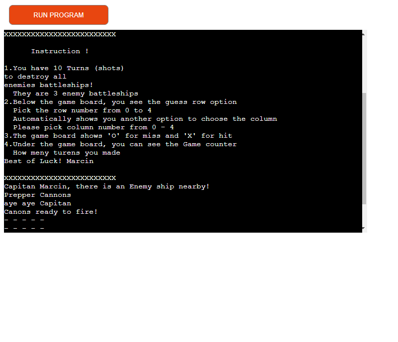

Welcome Marcin Olszewski,

This is the Code Institute student template for deploying your third portfolio project, the Python command-line project. The last update to this file was: **August 17, 2021**

## Reminders

* Your code must be placed in the `run.py` file
* Your dependencies must be placed in the `requirements.txt` file
* Do not edit any of the other files or your code may not deploy properly

## Creating the Heroku app

When you create the app, you will need to add two buildpacks from the _Settings_ tab. The ordering is as follows:

1. `heroku/python`
2. `heroku/nodejs`

You must then create a _Config Var_ called `PORT`. Set this to `8000`

If you have credentials, such as in the Love Sandwiches project, you must create another _Config Var_ called `CREDS` and paste the JSON into the value field.

Connect your GitHub repository and deploy as normal.

## Constraints

The deployment terminal is set to 80 columns by 24 rows. That means that each line of text needs to be 80 characters or less otherwise it will be wrapped onto a second line.

-----
Happy coding!

Welcome to Battleship game this is Single player game:
As a Player, the game has to offer : 

    The Game has only one player option, and as a user at the start of the game, you have a welcome message and instructions to put your name as a captain. 

    There is Player name validation, if a player leaves a blank space or only two letters there will be an error message 'invalid name' player has to type in the correct player name.

    When the player type in the correct name, The game will start and the first few lines are instructions on how to play the game.

    There is a small storyline for the player to feel and get into the game.

    
    The Player has a choice to pick a row and column number from 0 to 4 and the game board shows if he misses or hits the battleship. Showing 'X' for hit and 'O' for miss. There is a shot limit set to 10 shots, and how many shots we used after each turn.

    There is a winning and losing message for a player if he will successively guess or not. As an extra feature, there is a location of the sips after the player loses the game.

Features of the game The game have a 2 navigating options to choose from:

    Option one is to guess where he wants to shoot, and choose vertically a row from numbers 0-4.
    Option two is to guess where he wants to shoot horizontally and choose columns from numbers 0-4.

Future features
    - The game could link the project with Google Sheets to record the results of winning.
    - The game could evolve into 2 two-player game.

Technology:

    Main technology
        Tower PC with Windows 10 Pro
        Visual studio code
        python programming language to write code
        GitHub, Git, and Gitpod workspace
        Display repository
        Committing code to the Gitpod
        pep 8 code Validator link to Python code
        Grammarly for grammar and spelling mistakes.

Testing:

    Testing in PEP8 Python Validator:
    To check if my code does not have error messages:

    Testing wins:
    When a Player wins the game there he can find a congratulatory message. The messages only show when the player wins the game.

    Testing loes:
    The player has messages that he runs out of ammunition and the position of the enemy ships. There is a Location for the remaining ships after the player runs out of turns.

 There is as well anothen function for player, if the number of the row or column is beyond 0 to 4 then Player looses the shot and the game showing massage is was too far 