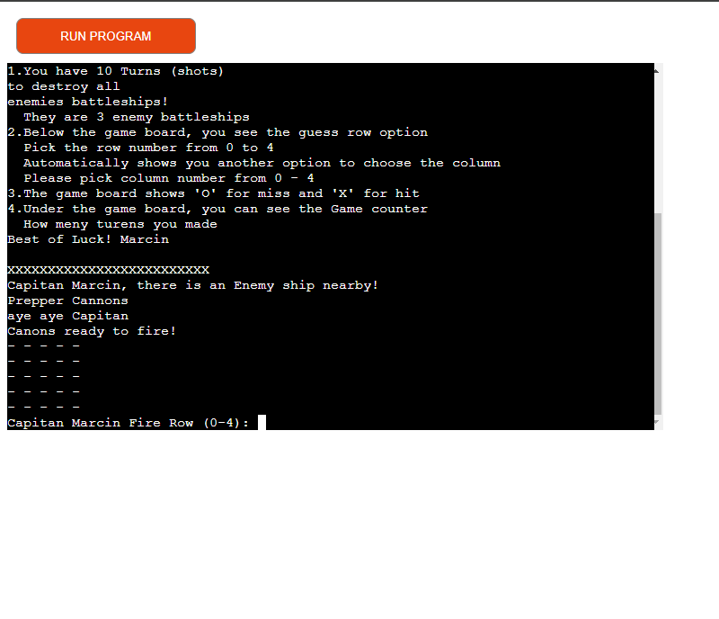
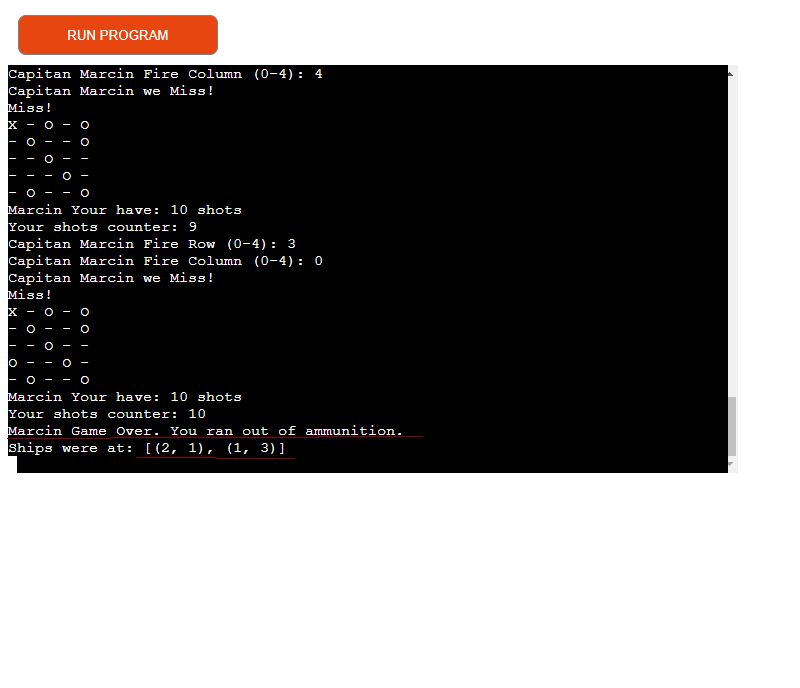

Battleship game!

Welcome to Battleship game this is Single player game:
As a Player, the game has to offer : 

    The Game has only one player option, and as a user at the start of the game, you have a welcome message and instructions to put your name as a captain. 

    There is Player name validation, if a player leaves a blank space or only two letters there will be an error message 'invalid name' player has to type in the correct player name.

    When the player type in the correct name, The game will start and the first few lines are instructions on how to play the game.

    There is a small storyline for the player to feel and get into the game.

    
    The Player has a choice to pick a row and column number from 0 to 4 and the game board shows if he misses or hits the battleship. Showing 'X' for hit and 'O' for miss. There is a shot limit set to 10 shots, and how many shots we used after each turn.

    There is a winning and losing message for a player if he will successively guess or not. As an extra feature, there is a location of the sips after the player loses the game.

Features of the game The game have a 2 navigating options to choose from:

    Option one is to guess where he wants to shoot, and choose vertically a row from numbers 0-4.
    Option two is to guess where he wants to shoot horizontally and choose columns from numbers 0-4.

Future features
    - The game could link the project with Google Sheets to record the results of winning.
    - The game could evolve into 2 two-player game.

Technology:

    Tower PC with Windows 10 Pro
    Python programming language to write code
    GitHub, Git, and Gitpod workspace platform to perform and deploy for display.
[Link for Github](https://github.com/Cinula)

    Pep 8 code Validator link to Python code
[link for pep8 validator](https://pep8ci.herokuapp.com/)
    Grammarly for grammar and spelling mistakes.

Testing:

    Testing in PEP8 Python Validator:
    To check if my code does not have error messages:

    Testing wins:
    When a Player wins the game there he can find a congratulatory message. The messages only show when the player wins the game.

    Testing loes:
    The player has messages that he runs out of ammunition and the position of the enemy ships. There is a Location for the remaining ships after the player runs out of turns.

    There is also another function for the player, if the number of the row or column is beyond 0 to 4 then the Player loses the shot and the game shows the message is too far 

Bugs and errors :

    - Lines too long 
    - Whitespaces in the code 
    - Need to be two spaces between function lines
    - Grammar mistakes

Deployment

    This website was deployed to the GitHub page as my repository the steps are below.
        I used the template from the Code Institute GitHub page and clicked on use this template.
        Automatically directed me to a new repository page in my GitHub account. 
        Type in the new repository name and click Create Repository.

    The dev environment was Gitpod workspace, in which the code was written. The steps to was:
        Sign up account with an email address created by Code Institute with your email address.
        On the Gitpod workspace dashboard click new workspace, select the repository, place the repository link in a placeholder, and click chosen repository and workspace ready to work on. 

    Heroku cloud application platform, steps i did:
        Create an account on Heroku Use an email address, password, and personal details information and click Create an account. 
        Click Create New Application, choose a unique name for the app, choose a region, and create an app.
        Go to settings and choose build pack python and nodejs in the correct order 1. python 2. nodejs click save.
        Choose deployment methods, from the 3 options select Github, type in the repository name, and click search. 
        chose your repository from Github by name and click connect to link your Heroku account with the GitHub repository
        At the bottom of the page are automatic and manual deploy, I use the manual deploy.
        To test the app click open app from the top right corner.

Credits
    
    Content

    The information for the game was taken from Code Institute from idea example 2.
    I gathered the information for a better understanding of the game engine and how to create Python code on YouTube the links are below:
[Youtube_link](https://www.youtube.com/watch?v=tF1WRCrd_HQ&t=124s)

 Special thanks to:

     My mentor, "Rohit Sharma" for helping me with my third project.
     My colleague from the Slack community Tomáš Kubánčik (Helped with fixing the Code)
     Code Institute tutor team for helping me sort out some issues. 

Thank you